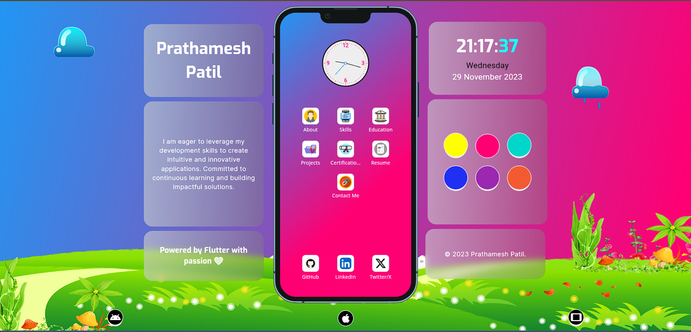

# Portfolio Web App using Flutter

This is an interactive and responsive portfolio web application built using Flutter with provider and firebase hosting.

 

## Portfolio Link

### [https://prathamesh-patil-700c0.web.app](https://prathamesh-patil-700c0.web.app)

 

## Portfolio

  

---
